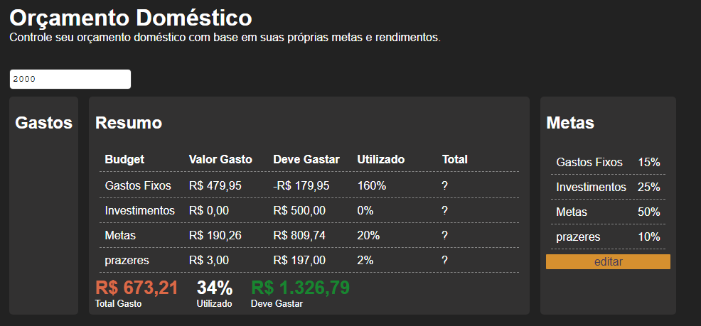

# resumindo
O objetivo deste projeto é facilitar o seu controle financeiro e permitir que você
tenha uma visão mais clara e objetiva dos seus gastos.

Ajuste suas despezas de acordo com suas metas e renda.

## Deve ser implementado

- [ ] Alterar/deletar os budgets.
- [ ] Alterar entre os meses cadastrados.
- [ ] Atualizar todos os valores(R$) autoamticamente em qualquer mudança.
- [ ] Correção de responsividade ( Mobile )

### Inspiração

Desenvolvi este projeto depois de ter asistido um vídeo sobre controle financeiro, vi este mesmo programa e me desafiei a fezê-lo. 

Recomendo fortemente que você que está lendo dê uma olhada.

<a href="https://www.youtube.com/watch?v=oLMxWL2w5PY&t=495s">Como organizar as contas de casa? (Orçamento doméstico) - @investidorsardinha</a>
